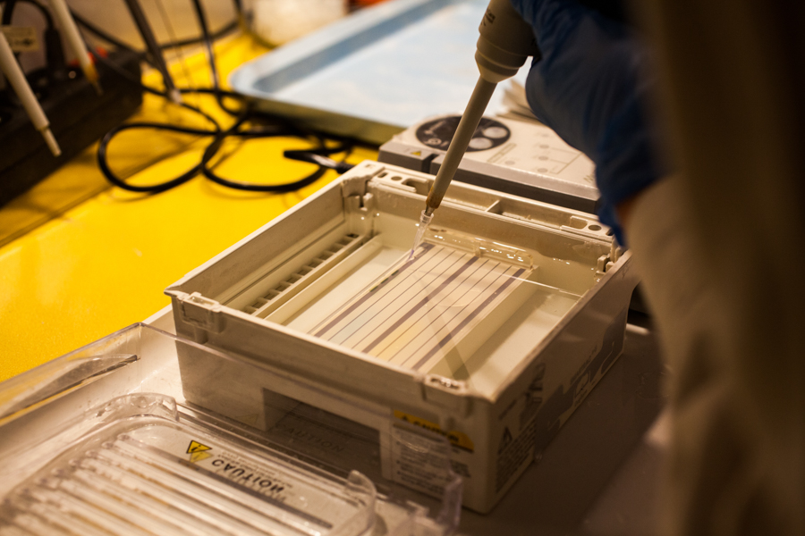
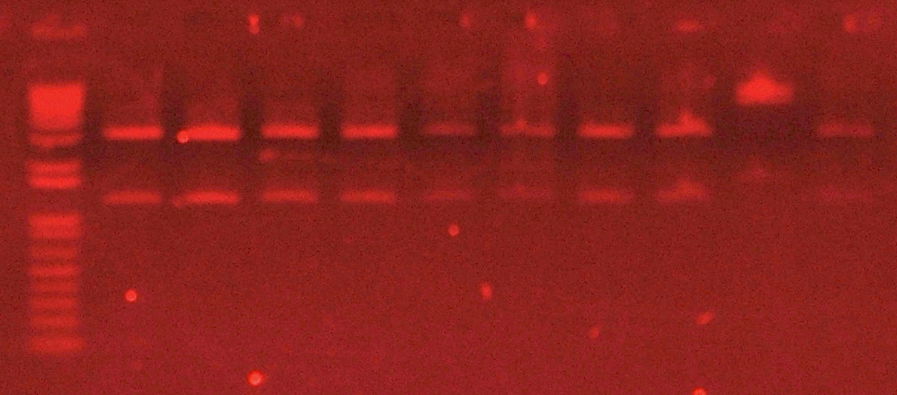

# Agarose Gel Electrophoresis (Demo)

## 1. Purpose

This Standard Operating Procedure (SOP) outlines the standard workflow for the separation of DNA or RNA fragments based on their size using horizontal agarose gel electrophoresis.

## 2. Scope

This procedure is applicable to the analysis of PCR products, enzyme digestion fragments, and purified genomic DNA or RNA within a laboratory setting.

**Disclaimer: This is a demonstrational document only and should not be used for actual laboratory work without verification by qualified personnel and adherence to institution-specific safety guidelines.**

## 3. Responsibilities

* All personnel performing this procedure must be trained in basic molecular biology techniques and safe handling of equipment and chemicals.
* The Laboratory Manager is responsible for ensuring that all equipment is calibrated and maintained.

## 4. Safety Precautions

| Hazard | Source | Mitigation |
| --- | --- | --- |
| **Electrical** | Electrophoresis Power Supply | Ensure leads are connected correctly; do not touch the apparatus when power is on; use equipment with interlocks. |
| **Thermal** | Molten Agarose | Use heat-resistant gloves when handling flasks from the microwave/autoclave. |
| **Chemical** | Ethidium Bromide (EtBr) | **CAUTION:** EtBr is a potential carcinogen and mutagen. Wear gloves and a lab coat; handle EtBr-containing gels and buffers within a designated area; dispose of waste according to institutional guidelines. |
| **Radiation** | UV Light | Wear UV-blocking face shields or goggles; minimize exposure time to UV light. |

## 5. Materials and Equipment

### 5.1 Equipment

1. Horizontal Electrophoresis Chamber/Tank
2. Power Supply (capable of constant voltage or current)
3. Gel Casting Trays
4. Sample Combs (varying lane number/volume)
5. Microwave or Hot Plate
6. Analytical Balance
7. UV Transilluminator or Gel Documentation System
8. Pipettes (1 µL to 1000 µL) and barrier tips

### 5.2 Reagents

1. Agarose powder (electrophoresis grade)
2. Electrophoresis Buffer (e.g., 1X TAE or 1X TBE)
3. 6X DNA Loading Dye
4. DNA Molecular Weight Marker (DNA Ladder)
5. **Staining Solution (Demo Example):** Ethidium Bromide (EtBr stock solution, 10 mg/mL)
6. DNA Samples

## 6. Procedure

### 6.1 Gel Preparation (Casting)

1. **Calculate Agarose Amount:** Determine the desired gel percentage (w/v) based on the expected size of the DNA fragments. For example, to prepare 100 mL of a 1% agarose gel, weigh out 1.0 g of agarose powder.
2. **Dissolve Agarose:** Combine the weighed agarose powder with 100 mL of 1X running buffer (TAE or TBE) in a microwavable flask. Swirl to mix.
3. **Heated Dissolution:** Heat the mixture in a microwave using short bursts (30 seconds), swirling in between, until the agarose is completely dissolved and the solution is clear. **CAUTION:** Use heat-resistant gloves; the flask will be hot.
4. **Cooling:** Allow the molten agarose to cool on the bench or in a water bath to approximately 50–60°C.
5. **Add Stain (Optional pre-staining):** If pre-staining the gel with Ethidium Bromide, add 5 µL of EtBr stock solution (10 mg/mL) per 100 mL of cooled agarose (final concentration: 0.5 µg/mL). Swirl gently to mix without creating bubbles.
6. **Cast the Gel:** Seal the ends of the gel casting tray (using tape or gaskets), and place the desired comb into the tray. Slowly pour the cooled agarose into the tray.
7. **Solidification:** Allow the gel to sit undisturbed at room temperature for 30–45 minutes until it is completely solidified and appears opaque.

### 6.2 Sample Loading and Running

1. **Prepare Tank:** Carefully remove the tape/gaskets from the casting tray and the comb from the gel. Place the tray containing the solidified gel into the electrophoresis chamber.
2. **Add Buffer:** Fill the chamber with 1X running buffer (use the same buffer used to make the gel) until the gel is completely submerged (approximately 2-5 mm over the gel surface).
3. **Sample Preparation:** In a sterile microcentrifuge tube, mix the DNA sample with 6X Loading Dye. For example, mix 5 µL of sample with 1 µL of dye.
4. **Load Samples:** Using a fresh pipette tip for each sample, carefully load the prepared sample into the wells. Ensure the negative electrode (black) is at the same end as the wells.
* *Note: Load a molecular weight marker into one or two lanes for size estimation.*
* **Reference:** Figure 1 demonstrates the correct technique for applying a PCR reaction product to an agarose gel well.

5. **Run Electrophoresis:** Place the lid on the tank and connect the leads to the power supply. Set the desired voltage (e.g., 80–120V, or approximately 5V/cm of gel length). Turn on the power supply.
6. **Monitor Run:** Confirm that bubbles are forming at the electrodes, indicating current flow. Allow the gel to run until the dye front has migrated approximately 75–80% down the gel length.

### 6.3 Visualization and Documentation

1. **Discontinue Run:** Turn off the power supply, disconnect the leads, and carefully remove the lid from the chamber.
2. **Staining (Optional post-staining):** If EtBr was not added to the gel during casting, carefully transfer the gel to a container containing 1X buffer with EtBr (0.5 µg/mL) for 15–30 minutes. Rinse briefly in distilled water or running buffer afterwards.
3. **Visualization:** Carefully transfer the stained gel to a UV transilluminator or a gel documentation system. **CAUTION:** Always wear a UV-protective face shield or goggles.
4. **Documentation:** Turn on the UV light to visualize the DNA bands. Capture an image of the gel for your records.
* **Reference:** Figure 2 shows the final appearance of an agarose gel stained with ethidium bromide and visualized under UV light, highlighting separated DNA fragments.

## 7. Waste Disposal

1. **Gels and Buffer (containing EtBr):** Dispose of all EtBr-contaminated materials as hazardous chemical waste according to institutional guidelines.
2. **Uncontaminated Waste:** Gels and buffers not containing hazardous stains can generally be disposed of as standard biological or chemical waste, provided they adhere to local regulations.